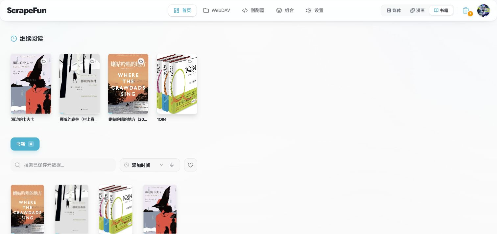
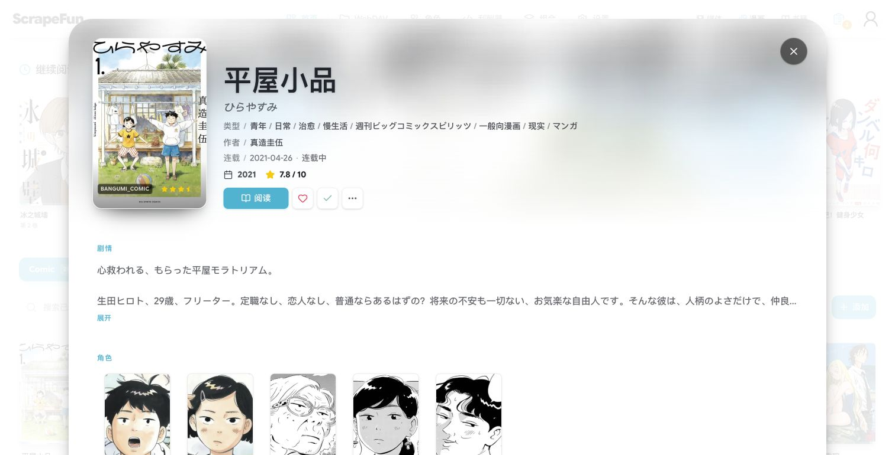

<div align="center">
  
  <h1>ScrapeFun</h1>
  <p>Self-hosted media server · Movies, comics, and remote media in one place</p>
  <p><a href="./README.md">简体中文</a> · <strong>English</strong></p>
  <p>
    <a href="https://scrapefun.com/?lang=en">Product website</a> ·
    <a href="./docs/README.en.md">Documentation</a> ·
    <a href="#downloads-and-deployment">Downloads</a> ·
    <a href="./SUPPORT.en.md">Support</a>
  </p>
  
</div>

> Updated: 2026-09-28. Platforms ship independently. Check the relevant release for its version, system requirements, and installation notes.

ScrapeFun brings metadata scraping, resource browsing, playback, reading, and user management into a self-hosted service. Deploy Server on Linux / NAS, macOS, or Windows, then connect through a browser or a dedicated Client.

This repository contains public product documentation, deployment templates, and extension examples. It does not publish the complete product source code. Platform repositories provide release assets and installation instructions.

## Downloads and deployment

Deploy a Server first, then install a Client if needed. Server stores libraries, users, configuration, and progress. Client connects to an existing Server. You can also access Server directly in a browser.

| Type | Platform | Published installation format | Links |
| --- | --- | --- | --- |
| Server | Linux / NAS | Docker, `linux/amd64` / `linux/arm64` | [Docker deployment](./DOCKER_GUIDE.en.md) |
| Server | macOS | Apple Silicon / arm64 DMG | [Installation](https://github.com/HaoweiLi97/scrapefun-server-macos/blob/main/README.en.md) · [Stable release](https://github.com/HaoweiLi97/scrapefun-server-macos/releases/latest) |
| Server | Windows | x64 installer | [Installation](https://github.com/HaoweiLi97/scrapefun-server-windows/blob/main/README.en.md) · [Stable release](https://github.com/HaoweiLi97/scrapefun-server-windows/releases/latest) |
| Client | Linux | x64 deb / AppImage | [Installation](https://github.com/HaoweiLi97/scrapefun-client-linux/blob/main/README.en.md) · [Stable release](https://github.com/HaoweiLi97/scrapefun-client-linux/releases/latest) |
| Client | macOS | Apple Silicon / arm64 DMG | [Installation](https://github.com/HaoweiLi97/scrapefun-client-macos/blob/main/README.en.md) · [Stable release](https://github.com/HaoweiLi97/scrapefun-client-macos/releases/latest) |
| Client | Windows | x64 / ARM64 installer | [Installation](https://github.com/HaoweiLi97/scrapefun-client-windows/blob/main/README.en.md) · [Stable release](https://github.com/HaoweiLi97/scrapefun-client-windows/releases/latest) |
| Client | Android | arm64-v8a / armeabi-v7a APK | [Installation](https://github.com/HaoweiLi97/scrapefun-client-android/blob/main/README.en.md) · [Stable release](https://github.com/HaoweiLi97/scrapefun-client-android/releases/latest) |

Formats above were checked against published stable assets on 2026-09-28. Check Release Assets before expecting another architecture or package format.

## Quick start

After installing Docker and the Docker Compose plugin on Linux, run:

```bash
curl -fsSL https://raw.githubusercontent.com/HaoweiLi97/ScrapeFun/main/scripts/one-click-compose-deploy.sh | bash -s -- stable
```

Select a GPU mode when prompted. By default, the script stores deployment configuration in `~/scrapefun`, persistent data in `~/scrapefun-data`, and starts app plus a separate updater.

Open the following address after deployment:

```text
http://SERVER_IP:8096
```

Complete the setup wizard, configure administrator credentials, and add storage and libraries. NAS management-panel users should follow the [Compose guide](./DOCKER_COMPOSE_DEPLOYMENT.en.md). [Back up your data](./DOCKER_DATA_AND_BACKUP.en.md) before upgrading an existing instance.

## Capabilities

| Area | Capabilities |
| --- | --- |
| Media organization | Movie and TV metadata scraping, artwork and cast information, cleaning rules, custom and combined scrapers |
| Comic reading | Comic scanning, browser and client reading, saved reading progress |
| Remote resources | WebDAV / AList browsing and file management, remote-library scanning, resource connections |
| Playback and subtitles | Browser and client playback, synchronized playback progress, subtitle search and import |
| User management | Administrator and standard users, library access permissions, multiple devices |
| Extensions | Emby / Jellyfin-style compatibility interfaces, picture enhancement, and other Pro features |

Some advanced features require a valid ScrapeFun Pro entitlement. Feature scope and duration follow the [product entitlement information](https://scrapefun.com/?lang=en#/pro), purchase information, and the instance's license page. Player compatibility also depends on the client version, media codec, and Server configuration.

## Interface previews

These are actual product screenshots, shared with the [product website](https://scrapefun.com/?lang=en#/product). They show the Chinese interface; appearance can vary with platform, version, and personal settings.

<details>
  <summary>Comic library and reading progress</summary>

Browse titles and volumes, and see what you are currently reading.


</details>

<details>
  <summary>Book library</summary>

Browse books by cover and view titles in progress.



</details>

<details>
  <summary>Remote WebDAV resources</summary>

Browse remote directories and switch between posters and file lists.


</details>

<details>
  <summary>Title details</summary>

View artwork, metadata, descriptions, characters, and reading actions together.



</details>

## Documentation

| Task | Guide |
| --- | --- |
| Linux installation, updates, and channel changes | [Docker deployment and operations](./DOCKER_GUIDE.en.md) |
| Manual NAS configuration | [Docker Compose deployment](./DOCKER_COMPOSE_DEPLOYMENT.en.md) |
| Backup, migration, and recovery | [Persistent data, backup, and recovery](./DOCKER_DATA_AND_BACKUP.en.md) |
| Configuration fields | [Environment example](./.env.example) · [Configuration schema](./server-env.schema.json) |
| Custom scrapers | [English developer guide](./server/SCRAPER_GUIDE.md) · [Chinese guide](./server/SCRAPER_GUIDE.zh-CN.md) |
| Versions and update behavior | [Releases and compatibility](./RELEASE_POLICY.en.md) |
| Product issues and vulnerabilities | [Support](./SUPPORT.en.md) · [Security](./SECURITY.en.md) |
| Software licensing | [Licensing and agreements](./legal/README.en.md) |

More usage information is available in the [online documentation](https://scrapefun.com/?lang=en#/docs).

## Data and updates

Persist the complete Docker data root:

```yaml
volumes:
  - ./scrapefun-data:/app/data
```

Updating restarts Server and interrupts playback and background tasks. Back up first, update, then check login, libraries, images, and playback and reading progress. `latest` follows stable releases and `beta` follows prereleases; use an explicit version tag when you need a fixed version.

macOS Server 0.3.3 is available only for Apple Silicon. It has an ad-hoc integrity signature and is neither Apple Developer ID signed nor notarized. Follow the [platform installation instructions](https://github.com/HaoweiLi97/scrapefun-server-macos/blob/main/README.en.md#installation-and-first-launch).

## Contact and licensing

Report public product issues through [GitHub Issues](https://github.com/HaoweiLi97/ScrapeFun/issues) or the [product feedback page](https://scrapefun.com/?lang=en#/contact). For accounts, payments, or private logs, contact `scrapefun@outlook.com`. Commercial inquiries: `lihaowei977@gmail.com`.

See [licensing and agreements](./legal/README.en.md) for the scope of software, documentation, and third-party component licenses.
