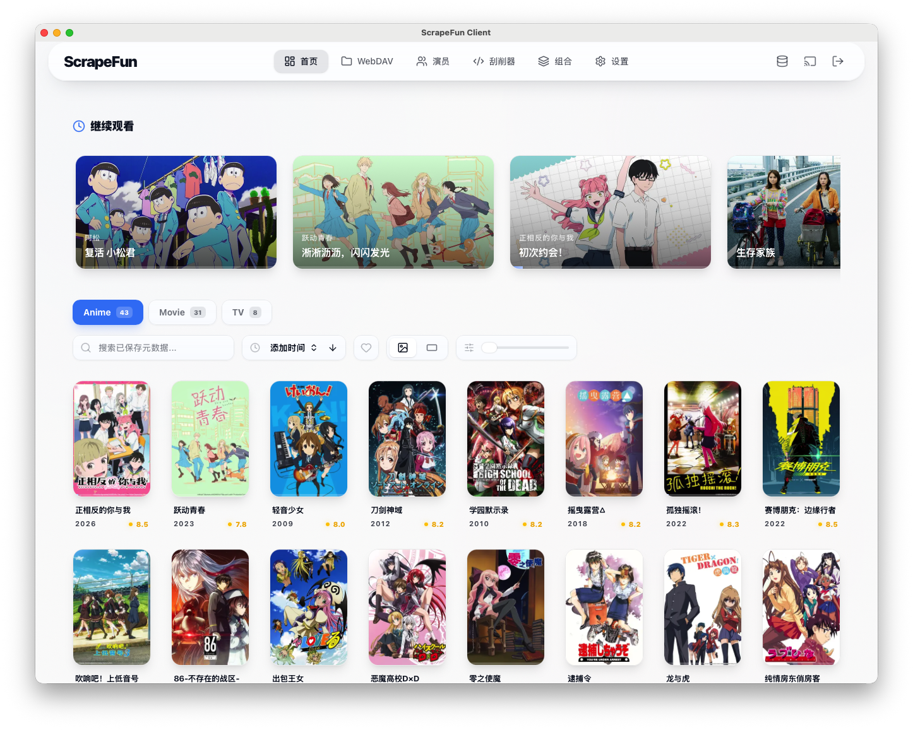

<div align="center">
  
  <h1>ScrapeFun</h1>
  <p>自带刮削引擎、原生 WebDAV 支持与播放器兼容层的媒体库管理平台</p>
  <p>
    <a href="https://hub.docker.com/r/haoweil/scrapefun/tags">
      
    </a>
    <a href="https://hub.docker.com/r/haoweil/scrapefun/tags?page=&name=beta">
      
    </a>
    <a href="https://github.com/HaoweiLi97/scrapefun-desktop-macos/releases/latest">
      
    </a>
  </p>
  
</div>

ScrapeFun 面向以网盘、WebDAV、AList 为核心存储方式的媒体库场景，提供从刮削、整理、字幕处理、播放兼容到多用户管理的一体化工作流。

如果你希望用更少的手工维护，搭建一个更适合个人、家庭或小规模共享的影视库服务，ScrapeFun 的设计目标就是把这些事情尽可能集中到一个系统里完成。

## 仓库导航

- [ScrapeFun 主仓库](https://github.com/HaoweiLi97/ScrapeFun)
- [ScrapeFun Desktop for macOS](https://github.com/HaoweiLi97/scrapefun-desktop-macos)
- [ScrapeFun Applications](https://github.com/HaoweiLi97/scrapefun-applications)

## 相关文档

- [Docker Compose 部署文档](./DOCKER_COMPOSE_DEPLOYMENT.md)
- [Docker 部署指南](./DOCKER_GUIDE.md)
- [Custom Scraper Development Guide (EN)](./server/SCRAPER_GUIDE.md)
- [自定义 Scraper 开发指南（中文）](./server/SCRAPER_GUIDE.zh-CN.md)

## 它适合谁

- 使用 WebDAV、AList、网盘或远程目录管理媒体文件的用户
- 希望减少手工整理、改名、匹配元数据成本的影视库维护者
- 需要字幕搜索、字幕本地化、播放进度同步的重度观影用户
- 想继续搭配 Infuse、Yamby、VidHub 等第三方播放器使用的人
- 需要多用户、库权限隔离、远程共享能力的小团队或家庭场景

## 核心能力

### 1. 媒体刮削与整理

- 支持自定义 scraper，具备 `search / scrape / getVideoUrl` 脚本流程
- 支持清洗脚本、刮削器绑定、优先级回退与组合刮削
- 支持按文件名、目录、集数等信息自动识别媒体内容
- 支持海报、简介、演员等元数据管理与编辑

### 2. WebDAV 与远程媒体库

- 原生 WebDAV 文件浏览与管理
- 支持列表、移动、复制、重命名、删除、创建文件夹
- 支持 AList / WebDAV 直链解析与流式播放转发
- 适合不做本地挂载、直接操作远程媒体目录的使用方式

### 3. 播放与字幕体验

- 支持直连 / 代理播放切换与链接自动重试
- 支持播放器内搜索字幕、上传字幕、导入字幕压缩包
- 支持字幕本地化持久存储，避免容器重建后丢失
- 支持电影与剧集播放进度同步

### 4. 多用户与兼容生态

- 支持用户管理、管理员角色、媒体库级权限控制
- 支持实时状态同步与 WebSocket 推送
- 提供 `/emby` 与 Jellyfin 风格兼容接口
- 可配合 Infuse、Yamby、VidHub、SenPlayer 等客户端使用

### 5. 部署与使用

- 支持 Docker / Docker Compose 部署
- 支持更新通道切换与 sidecar updater
- 适合自部署、家庭媒体库和客户交付场景
- 提供部署、升级、持久化和授权相关说明文档

## 快速开始

当前推荐通过 Docker Compose 部署。

端口说明：`0.1.3` 之前默认使用 `4000` 端口，`0.1.3` 及之后默认使用 `8096` 端口。

### 方式一：一键部署

```bash
curl -fsSL https://raw.githubusercontent.com/HaoweiLi97/ScrapeFun/main/scripts/one-click-compose-deploy.sh | bash
```

首次运行会完成以下事情：

- 拉取镜像
- 生成部署目录
- 初始化持久化数据目录
- 首次部署时让你选择 GPU 模式，并在后续更新时复用这个选择
- 生成 `server.env` 与 `.updater.env`
- 启动应用与 updater

如果 Docker Hub 拉取失败，脚本还会自动尝试下载对应架构的离线镜像 bundle 并执行 `docker load`，所以在网络不稳定或拉取受限的环境里也更稳。

后续更新继续运行同一个命令即可。脚本会自动判断已有部署，先停止容器，再拉取最新镜像并重新启动，同时复用已有端口、数据目录和更新频道：

```bash
curl -fsSL https://raw.githubusercontent.com/HaoweiLi97/ScrapeFun/main/scripts/one-click-compose-deploy.sh | bash
```

如果你不想交互选择 GPU，也可以直接传环境变量：

```bash
curl -fsSL https://raw.githubusercontent.com/HaoweiLi97/ScrapeFun/main/scripts/one-click-compose-deploy.sh | \
  SCRAPEFUN_GPU_MODE=nvidia bash
```

可选值：

- `none`：不透传 GPU，默认最稳
- `dri`：Intel / AMD / 大多数 NAS 集显，透传 `/dev/dri`
- `amd`：在 `dri` 基础上再加 `/dev/kfd`
- `nvidia`：为 Docker Compose 注入 `gpus: all`

### 方式二：手动部署

1. 准备 Docker 与 Docker Compose
2. 参考 [`docker-compose.remote.yml`](./docker-compose.remote.yml)
3. 根据需要配置环境变量
4. 启动服务并访问 `http://<server-ip>:8096`

## Docker 镜像现状

- Docker 镜像当前默认发布 `linux/amd64` 和 `linux/arm64`
- 镜像里已内置 `waifu2x_fast` 图像增强运行时
- Docker 环境下只开放 `waifu2x_fast`，不会再暴露 `realcugan` / `realesrgan`

如果你只是普通 CPU 部署，直接使用默认镜像即可。

如果你希望图像增强真正使用宿主机 GPU，还需要在部署侧额外透传 GPU 设备，见下方 GPU 说明。

## 使用说明

部署完成后，你可以在 Web 界面中完成以下常见操作：

- 配置 WebDAV / AList 媒体源
- 新建或绑定 scraper
- 管理媒体库、用户和访问权限
- 搜索与导入字幕
- 通过兼容接口接入第三方播放器

更完整的部署、更新和运维说明见下方文档链接。

## 关键环境变量

常见配置可参考 [`.env.example`](./.env.example)：

- `PORT`：服务端口，默认 `8096`
- `FLARESOLVERR_URL`：用于部分站点的反爬处理
- `TMDB_API_KEY`：可选的 TMDB 数据源配置
- `BANGUMI_API_KEY`：可选的 Bangumi 漫画数据源配置，默认留空
- `WEBDAV_URL` / `WEBDAV_USERNAME` / `WEBDAV_PASSWORD`：可选的 WebDAV 默认配置
- `LOCAL_SUBTITLE_DIR`：本地字幕持久化目录

## GPU 说明

Docker 镜像虽然已经包含 `waifu2x_fast` 和 Vulkan 相关运行时，但容器能不能真正拿到宿主机 GPU，取决于你的部署方式。

- Intel / AMD / 大多数 NAS 集显：通常至少要透传 `/dev/dri`
- 部分 AMD 设备：还需要 `/dev/kfd`
- NVIDIA：除了设备透传，还需要宿主机安装 `NVIDIA Container Toolkit`
- 一键脚本首次部署时会提示你选择 `none` / `dri` / `amd` / `nvidia`，并把结果保存到 `.updater.env`

如果没有这些设备映射，ScrapeFun 在 Docker 里通常只能回退到 CPU，或者直接拿不到 Vulkan 设备。

## 持久化建议

如果你使用 Docker 部署，建议至少持久化以下目录或 volumes：

- `db`
- `images`
- `config`
- `local-subtitles`

尤其是 `config` 与 `local-subtitles`，它们分别关系到实例状态保留与字幕本地化结果保留。

## 适用平台

- Linux 服务器
- Docker / Docker Compose 环境
- WebDAV / AList 媒体库场景
- 兼容 Infuse、Yamby、VidHub、SenPlayer 等客户端的使用链路

## 联系方式

- Product / Business: `lihaowei977@gmail.com`

## 开源说明

本仓库用于公开展示产品能力与使用说明，不包含完整业务源码。  
如需商业合作、部署支持或授权相关帮助，请通过邮箱联系。
