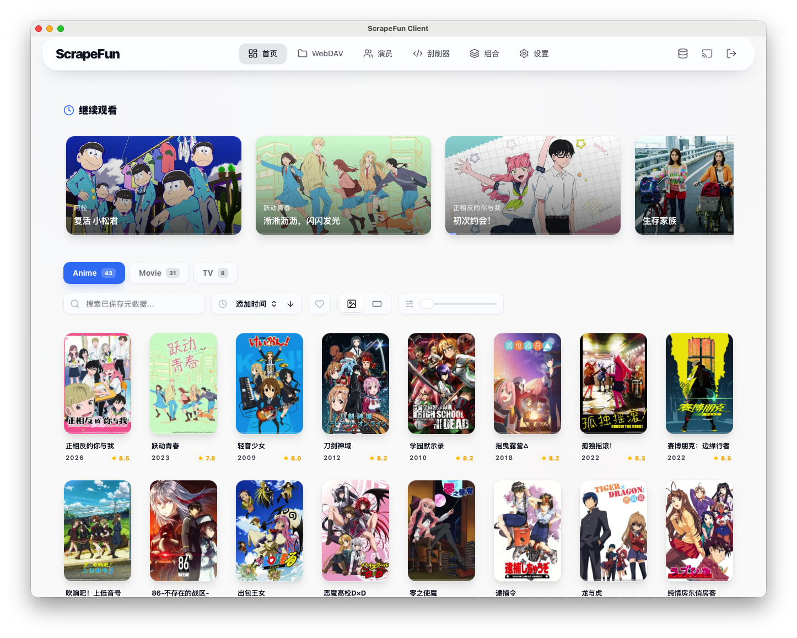

<div align="center">
  
  <h1>ScrapeFun</h1>
  <p>覆盖电影、剧集、漫画与远程资源的综合媒体服务器</p>
  <p>
    <a href="https://hub.docker.com/r/haoweil/scrapefun/tags"></a>
    <a href="https://github.com/HaoweiLi97/scrapefun-server-macos/releases/latest"></a>
    <a href="https://github.com/HaoweiLi97/scrapefun-server-windows/releases/latest"></a>
  </p>
  
</div>

> 最后更新：2026 年 7 月 26 日

ScrapeFun 是覆盖电影、剧集、漫画与远程资源的综合媒体服务器，提供媒体刮削、漫画阅读、WebDAV / AList 管理、字幕处理、播放兼容、多用户权限和桌面客户端连接能力，适合个人、家庭及小规模共享媒体库。

## 下载与部署

| 使用场景 | 下载或文档 |
| --- | --- |
| Linux / NAS Docker Server | [Docker 部署指南](./DOCKER_GUIDE.md) |
| macOS Server | [下载 DMG](https://github.com/HaoweiLi97/scrapefun-server-macos/releases/latest) |
| Windows Server | [下载安装程序](https://github.com/HaoweiLi97/scrapefun-server-windows/releases/latest) |
| Linux Client | [下载 deb / rpm](https://github.com/HaoweiLi97/scrapefun-client-linux/releases/latest) |
| macOS Client | [下载 DMG](https://github.com/HaoweiLi97/scrapefun-client-macos/releases/latest) |
| Windows Client | [下载安装程序](https://github.com/HaoweiLi97/scrapefun-client-windows/releases/latest) |

## 使用文档

- [Docker 一键部署与更新](./DOCKER_GUIDE.md)
- [NAS Docker Compose](./DOCKER_COMPOSE_DEPLOYMENT.md)
- [数据持久化与备份](./DOCKER_DATA_AND_BACKUP.md)
- [自定义 Scraper 开发指南（中文）](./server/SCRAPER_GUIDE.zh-CN.md)
- [Custom Scraper Development Guide (English)](./server/SCRAPER_GUIDE.md)
- [在线使用文档](https://scrapefun.com/deployment.html)

## 核心能力

### 影视刮削与整理

- 支持电影、剧集和资源类自定义 scraper
- 支持清洗规则、刮削器绑定、优先级回退和组合刮削
- 支持海报、背景图、演员、简介和剧集信息管理
- 支持用户安装或编辑自定义刮削器

### 漫画管理与阅读

- 统一扫描、整理和浏览漫画资源
- 支持网页与桌面客户端阅读
- 保存阅读进度，方便跨设备继续阅读
- 持久化漫画清单，重启服务后无需重新生成

### WebDAV 与远程媒体库

- 浏览和管理 WebDAV / AList 目录
- 支持移动、复制、重命名、删除和创建文件夹
- 支持直链解析、代理播放和失败重试
- 支持远程媒体库增量扫描与状态同步

### 播放与字幕

- 支持字幕搜索、上传、压缩包导入和本地化保存
- 支持电影与剧集播放进度同步
- 提供 Emby / Jellyfin 风格兼容接口
- 可配合 Infuse、Yamby、VidHub、SenPlayer 等播放器使用

### 用户与权限

- 多用户和管理员角色
- 媒体库级访问权限
- Web 与桌面客户端连接
- 实时状态同步

## Linux 一键部署

安装 Docker 后运行：

```bash
curl -fsSL https://raw.githubusercontent.com/HaoweiLi97/ScrapeFun/main/scripts/one-click-compose-deploy.sh | bash
```

脚本会创建部署目录、持久化目录和环境文件，选择 GPU 模式，并启动应用与 updater。

部署完成后访问：

```text
http://服务器IP:8096
```

安装 beta：

```bash
curl -fsSL https://raw.githubusercontent.com/HaoweiLi97/ScrapeFun/main/scripts/one-click-compose-deploy.sh | bash -s -- beta
```

重新运行标准命令即可回到 stable。

## GPU 配置

GPU 是部署配置的重要部分。首次安装时请按服务器硬件选择：

| 模式 | 适用硬件 | 容器配置 |
| --- | --- | --- |
| `dri` | Intel、大多数 AMD、大多数 NAS 集显 | `/dev/dri` |
| `amd` | 还需要计算设备的 AMD 主机 | `/dev/dri` 与 `/dev/kfd` |
| `nvidia` | 已安装 NVIDIA Container Toolkit 的主机 | `gpus: all` |
| `none` | 明确不使用硬件加速 | 不透传 GPU |

非交互指定示例：

```bash
curl -fsSL https://raw.githubusercontent.com/HaoweiLi97/ScrapeFun/main/scripts/one-click-compose-deploy.sh | \
  SCRAPEFUN_GPU_MODE=nvidia bash
```

## 数据持久化

Docker 部署应保留以下目录：

```text
scrapefun-data/
  db/
  images/
  config/
  custom-scrapers/
  local-subtitles/
```

数据库、图片、实例配置、自定义刮削器和本地字幕都会保存在这些目录中。更新或重建容器前，请确认 Compose 仍指向同一个 `scrapefun-data` 目录。

## 常用配置

常用环境变量可参考 [`.env.example`](./.env.example)：

- `PORT`：服务端口，默认 `8096`
- `APP_AUTH_SECRET`：生产环境登录令牌密钥
- `FLARESOLVERR_URL`：部分站点的反爬服务地址
- `TMDB_API_KEY`：可选 TMDB 数据源
- `BANGUMI_API_KEY`：可选 Bangumi 数据源
- `WEBDAV_URL` / `WEBDAV_USERNAME` / `WEBDAV_PASSWORD`：可选 WebDAV 默认配置

## 获取帮助

- [在线文档](https://scrapefun.com/deployment.html)
- [建议反馈](https://scrapefun.com/feedback.html)
- Product / Business：`lihaowei977@gmail.com`
